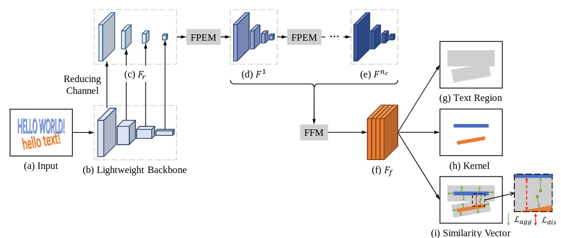
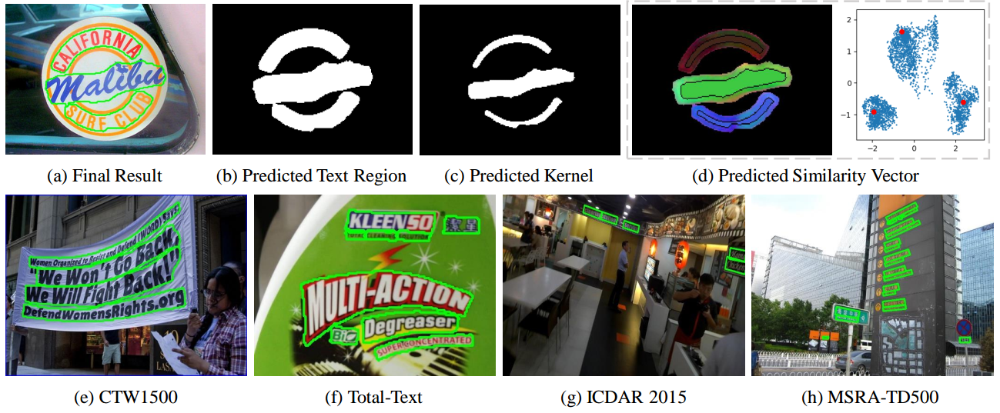

# PANet (Text detector)

## 1. Introduction
This is an re-implementation the paper "Efficient and Accurate Arbitrary-Shaped Text Detection with Pixel Aggregation Network" for Scene Text Detection.

The repository only focus on Architecture's Components, so full process may not be your need.

https://arxiv.org/abs/1908.05900

## 2. Project Usage
Note: This is pretty raw implementation and mainly focus on architecture, ideas. These things are not included in the project:

1. General dataset format (Only prepared for CTW1500)
2. Mixed-precision training
3. Pretrained weights. (All weights are from-scratch training and won't be the best weights compared to SynthText pretrained)
4. Deployment-ready. For deploy, i recommend follow existing framework like PaddleOCR or MMOCR for end-2-end training and deployment.

You should only use this project for research, study all the ideas are discussed in the paper.

### Note: This is a very simplified project, to start with this, please follow these steps:

Please use the **train.py** script to start, everything is included in it!.

If you only care about architecture, loss functions which is what you should do :) while looking through this project. Then the **src/components** is all you need. Enjoy.

This is quite iconic paper to study because it contains almost every aspect of segmentation-based text detection/localization:

1. Text region segmentation
2. Text kernel segmentation
3. Dice-coefficient
4. Lightweight backbone
5. FPN-like components
6. Post-processing
7. Similarity Vector (NEW)

## 3. TODO

I won't continue to code on this project. But you can!

There're many things to improve/try on this idea like: Changing backbone, tuning loss, pretraining, etc.

I will continue to answer question. If you have any trouble learning this concept, please open a Issue. I will try to answer it.

Some of postprocessing code are borrowed from https://github.com/WenmuZhou. Thanks!
